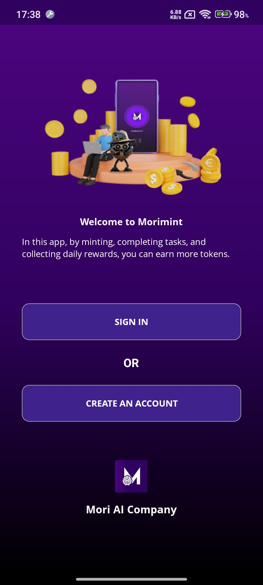
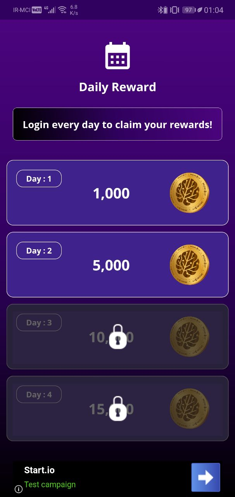
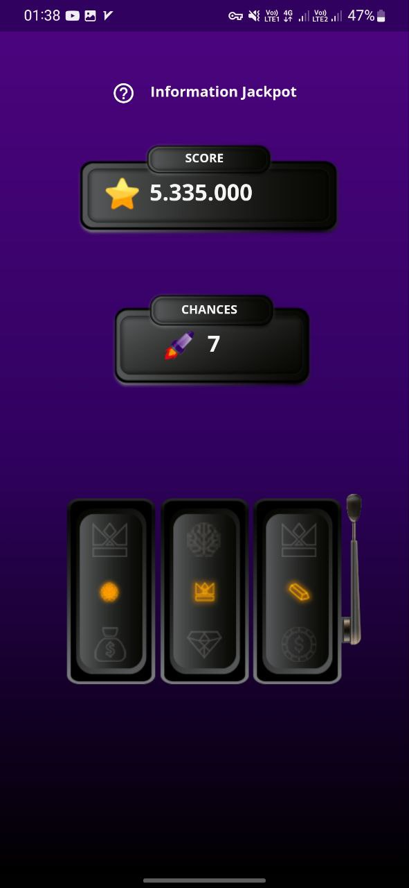
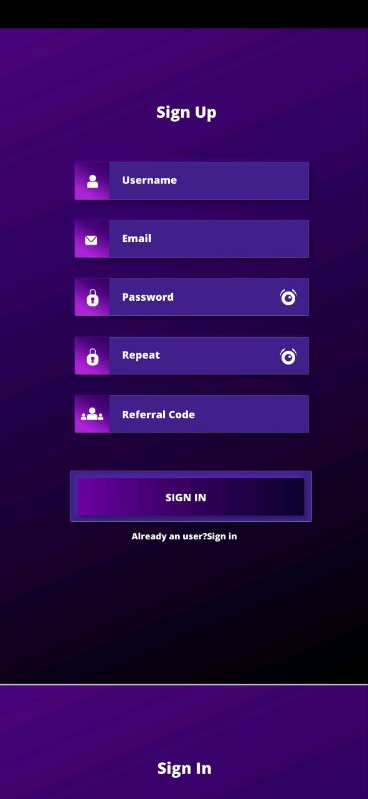
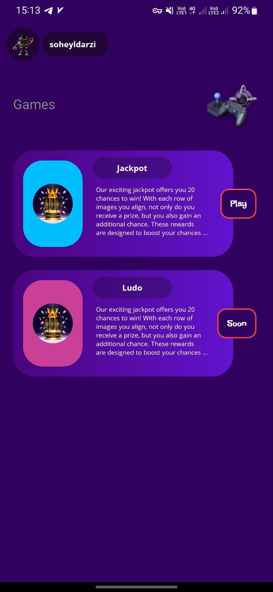
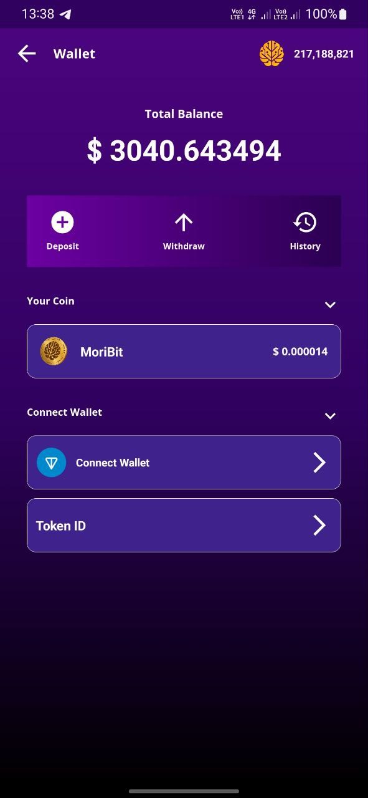
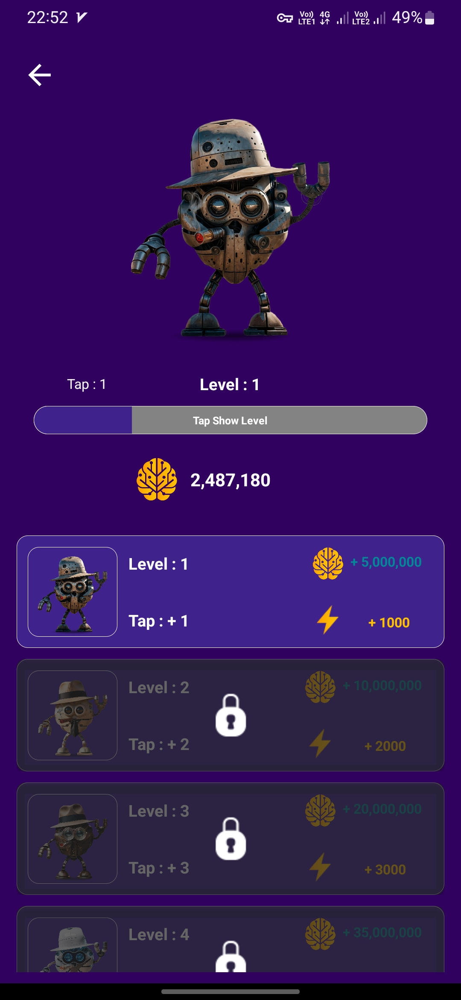

# MoriMint

## **Screenshots**

      

       

## **Project Overview**
Mori Mint Clicker Game is an interactive mobile game where users collect virtual coins by completing tasks, inviting friends, and playing engaging jackpot and board games. These virtual coins, once listed on a cryptocurrency exchange, are distributed to users as an airdrop, which is then withdrawable. The game includes features like daily rewards, energy management, and character progression, enhancing user engagement.

## **Key Features**

### **1. Click-to-Earn**
- Users collect virtual coins by clicking and completing in-game tasks, making it an easy and addictive way to earn rewards.

### **2. Daily Tasks & Rewards**
- Daily challenges keep users engaged by providing rewards for completing simple tasks, encouraging users to return to the app regularly.

### **3. Referral Program**
- Users can invite friends to the app, and both the referrer and the invitee earn rewards, fostering user growth and increasing the app’s reach.

### **4. Jackpot Game**
- A thrilling Jackpot game where users can spin for prizes. It uses a randomized point allocation system that adds excitement and unpredictability.

### **5. Energy Management**
- A dynamic energy system where users lose energy with each click but can refill it over time, with the addition of a Turbo mode to speed up the coin collection.

### **6. Character Progression**
- As users advance in levels, characters evolve and change, keeping the gameplay fresh and providing a sense of achievement.

### **7. Push Notifications**
- Integrated Firebase to send notifications about new tasks, rewards, and special events to keep users engaged and informed.

### **8. Secure & Fair Play**
- Implemented advanced security measures to prevent click fraud and cheating in the reward system, ensuring fair gameplay for all users.

### **9. Smooth UI/UX Design**
- Clean and attractive interface with animations powered by **Lottie** and **Confetti**, creating an immersive and visually satisfying experience.

---

## **Technologies Used**

- **Firebase**: For sending push notifications and in-app messages to engage users and inform them about rewards and tasks.
- **Retrofit**: To manage communication with the server through efficient RESTful API requests.
- **MVVM Architecture**: For maintaining clean and scalable code by separating business logic from UI components.
- **Security Crypto**: Used for encrypting sensitive data and ensuring the security of shared preferences.
- **Worker**: Managed background tasks to ensure smooth user experience even when the app runs in the background.
- **Lottie**: For integrating high-quality, interactive animations to improve the UI.
- **Confetti**: Used for celebratory animations when users complete key actions in the app (e.g., successful tasks or jackpot wins).
- **Adimajia Android Animation**: Managed in-app animations for smooth transitions and visual effects.
- **GetKeepSafe TargetView**: To display in-app tutorials and help users navigate the game smoothly.

---

## **Key Achievements**

- **User Acquisition**: Attracted 1,600 active users within the first two weeks through engaging gameplay, rewards, and referral incentives.
- **High Engagement**: Increased user retention with features like daily tasks, Jackpot games, and Turbo mode, which incentivized users to stay longer in the app.
- **Security & Fraud Prevention**: Implemented robust anti-cheat mechanisms to detect and prevent click fraud and bot usage, ensuring a fair playing environment.
- **Gamification & UX**: Designed captivating and evolving character progressions, adding value and enhancing the game experience with visually appealing animations.
- **Positive User Feedback**: The app received high ratings and positive reviews due to its smooth UI, rewarding gameplay, and attractive features.

---

## **Unfinished Features (Due to Project Cancellation)**

- **WebSocket Chatbot**: A WebSocket-based chatbot to handle real-time interactions between users while reducing server load, which was not completed.
- **Online Ludo Game**: The multiplayer online Ludo game was planned but never implemented due to project cancellation.
- **NFT Characters**: The game characters were planned to be turned into NFTs to offer digital ownership to users, but this feature was not completed.
- **Cheating Detection System**: A reporting and tracking system for detecting cheaters in games and notifying admins, which was partially developed but left incomplete.

---

## **Project Challenges & Reasons for Cancellation**

- **Client's Changing Requirements**: The project was canceled due to the client changing their vision and priorities for the app.
- **Budget Constraints**: The project faced budget limitations, which hindered further development and deployment of the app.
- **Unreleased App**: Despite the app being in its final stages of development, it was never released due to changes in direction and resource limitations.

---

## **Project Impact & User Feedback**

- **User Growth**: Despite the project’s cancellation, the app had over 1,600 active users within two weeks of its beta release.
- **User Retention**: Features like daily rewards, Jackpot games, and the energy system helped maintain high levels of user engagement.
- **Positive Reviews**: Users praised the smooth gameplay, visually appealing animations, and innovative features, leading to high ratings and positive feedback.

---

## **Development Company:**
**MoriAi** - Based in Oman.

---

## Connect with Me

- [Instagram](https://www.instagram.com/rarestar.dev)
- [Telegram](https://t.me/Rarestar_dev)

## License

This project is licensed under the MIT License - see the [LICENSE](LICENSE) file for details.
